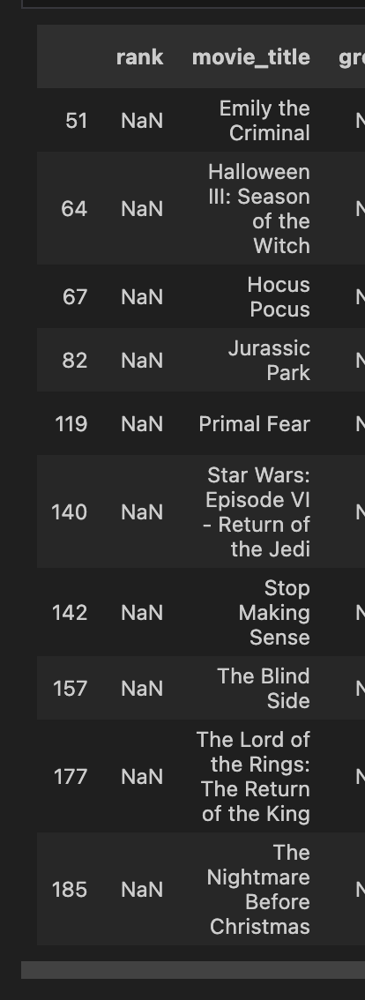

https://www.rottentomatoes.com/browse/movies_at_home/affiliates:netflix~sort:popular?page=2
https://entertainmentstrategyguy.com/2023/04/05/the-data-is-in-theatrical-films-massively-outperform-straight-to-streaming-films/#:~:text=The%20streamers%20have%20always%20argued,went%20straight%20to%20a%20streamer.

## overall need to co
* drop the re-releases
* do the manual mappings
* re-run things with missing rotten tomato scores, see how many we can grab
* begin write up
* clean up

## Notes
Total gross is total amount of $ the movie makes over its run, gross is the gross in that year
Tried rapidFuzz, missed some basic things, so didnt' spend time on

## todo now
* go through misssing data -- probbably fuzzy matching
    * spend a little more time on fuzzy matching
    * see how gpt does
        better  
    https://www.rottentomatoes.com/m/billie_eilish_live_at_the_o2_extended_cut

* other general QA
    * are we getting the right movies?
    * drop re-releases, anniversary

## Could do overall backlog
* do fuzzy matching
* scrape last year, scrape ever year from 2000 onwards 
* look into heteroskedasticity: https://communities.sas.com/t5/SAS-Code-Examples/A-Simple-Regression-Model-with-Correction-of-Heteroscedasticity/ta-p/904863#:~:text=One%20way%20to%20correct%20for,the%20regressors%20or%20its%20square.
* control for days in theater -- doesn't quite work since some things are 2022 that are in there. Could go in and grab the proper release dates and the length of their runs
* winsorize instead of dropping
* how do these re-releases do?

